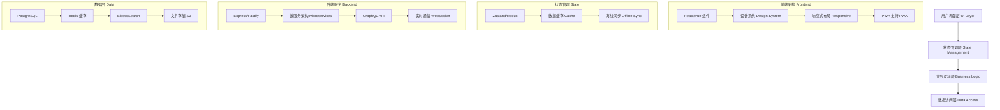
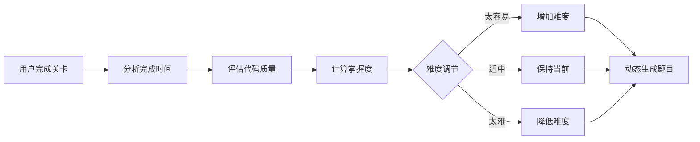
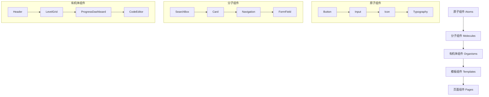
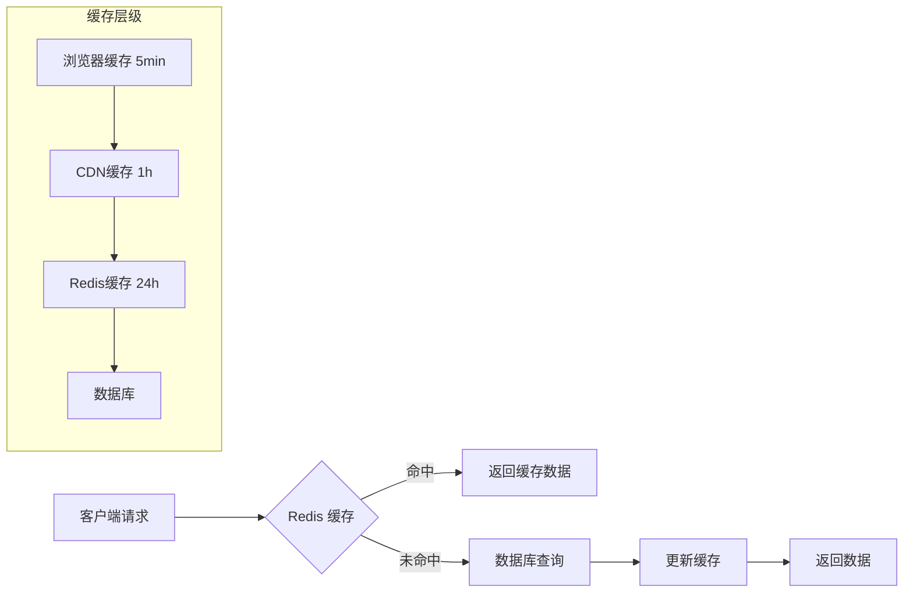
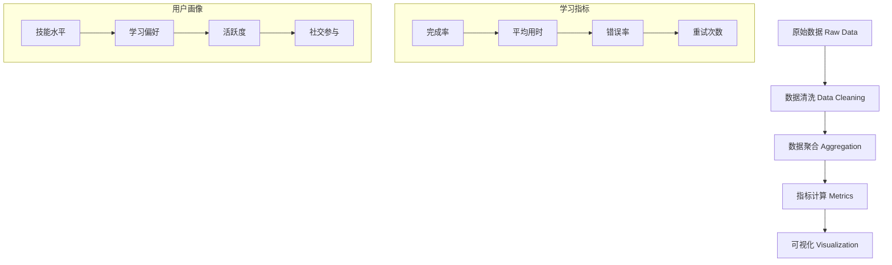
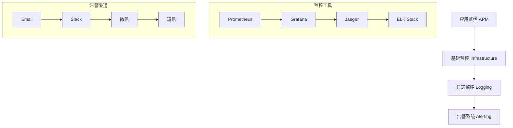
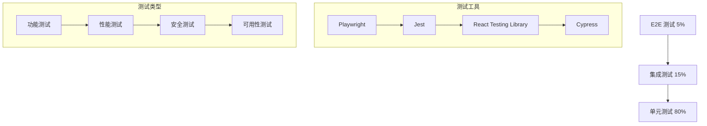

# ELP 前端工程化学习平台优化设计

## 概述

ELP (Engineering Learning Platform) 是一个创新的前端工程化学习平台，通过关卡式学习帮助开发者掌握现代前端构建工具。本设计文档提供了将项目完善为业界标杆级别的全面优化方案。

## 架构升级

### 核心架构优化



### 技术栈升级方案

#### 前端技术栈

| 技术 | 当前版本 | 建议升级 | 理由 |
|------|----------|----------|------|
| 构建工具 | 原生JS | React 18 + TypeScript | 提供类型安全和组件化开发 |
| 状态管理 | 无 | Zustand 4.0 | 轻量级响应式状态管理 |
| 路由 | 无 | React Router 6 | 单页应用路由管理 |
| UI框架 | 手写CSS | Tailwind CSS + Shadcn/ui | 快速构建现代界面 |
| 代码编辑器 | CodeMirror 5 | Monaco Editor | 更强大的代码编辑体验 |

#### 后端技术栈

| 技术 | 当前版本 | 建议升级 | 理由 |
|------|----------|----------|------|
| 框架 | Express 4.18 | Fastify 4.0 | 更高性能和现代化API |
| 数据库 | 文件系统 | PostgreSQL 15 | 强大的关系型数据库 |
| 缓存 | 无 | Redis 7.0 | 高性能数据缓存 |
| 搜索 | 无 | ElasticSearch 8.0 | 全文搜索和分析 |
| 文件存储 | 本地 | AWS S3/MinIO | 可扩展的对象存储 |

## 功能增强

### 智能学习系统

#### AI 驱动的个人学习助手

```typescript
interface LearningAssistant {
  // 学习路径推荐
  recommendPath(userProfile: UserProfile): LearningPath;
  
  // 实时答疑
  answerQuestion(question: string, context: LevelContext): Answer;
  
  // 代码审查
  reviewCode(code: string, level: Level): CodeReview;
  
  // 学习进度预测
  predictProgress(currentLevel: Level, timeSpent: number): ProgressPrediction;
}
```

#### 自适应难度调节



### 社交化学习

#### 学习社区功能

```typescript
interface CommunityFeatures {
  // 学习小组
  studyGroups: {
    create(name: string, maxMembers: number): StudyGroup;
    join(groupId: string): boolean;
    collaborate(groupId: string, challenge: Challenge): CollaborationSession;
  };
  
  // 代码分享
  codeSharing: {
    share(code: string, level: Level): SharedCode;
    fork(sharedCodeId: string): UserCode;
    comment(sharedCodeId: string, comment: string): Comment;
  };
  
  // 排行榜
  leaderboard: {
    global(): LeaderboardEntry[];
    weekly(): LeaderboardEntry[];
    friends(): LeaderboardEntry[];
  };
}
```

#### 导师系统

```typescript
interface MentorSystem {
  // 专家导师
  mentors: {
    findMentor(skill: string): Mentor[];
    requestGuidance(mentorId: string, question: string): GuidanceRequest;
    scheduleSession(mentorId: string, time: Date): MentorSession;
  };
  
  // 同伴互助
  peerHelp: {
    askForHelp(level: Level, question: string): HelpRequest;
    offerHelp(helpRequestId: string): HelpOffer;
    rateHelp(helpSessionId: string, rating: number): void;
  };
}
```

### 企业级功能

#### 团队学习管理

```typescript
interface TeamManagement {
  // 企业管理
  enterprise: {
    createTeam(name: string, members: string[]): Team;
    assignLearningPath(teamId: string, path: LearningPath): void;
    trackTeamProgress(teamId: string): TeamProgress;
    generateReport(teamId: string, period: TimePeriod): LearningReport;
  };
  
  // 技能评估
  assessment: {
    createCustomAssessment(skills: Skill[]): Assessment;
    conductAssessment(userId: string, assessmentId: string): AssessmentResult;
    certifySkill(userId: string, skill: Skill): Certificate;
  };
}
```

## 用户体验优化

### 界面设计系统

#### 设计令牌 Design Tokens

```typescript
const DesignTokens = {
  colors: {
    primary: {
      50: '#eff6ff',
      500: '#3b82f6',
      900: '#1e3a8a'
    },
    semantic: {
      success: '#10b981',
      warning: '#f59e0b',
      error: '#ef4444',
      info: '#3b82f6'
    }
  },
  spacing: {
    xs: '0.25rem',
    sm: '0.5rem',
    md: '1rem',
    lg: '1.5rem',
    xl: '2rem'
  },
  typography: {
    fontFamily: {
      sans: ['Inter', 'system-ui', 'sans-serif'],
      mono: ['JetBrains Mono', 'monospace']
    },
    fontSize: {
      xs: '0.75rem',
      sm: '0.875rem',
      base: '1rem',
      lg: '1.125rem',
      xl: '1.25rem'
    }
  }
}
```

#### 组件库架构



### 响应式设计

#### 断点系统

```css
/* 响应式断点 */
:root {
  --breakpoint-sm: 640px;
  --breakpoint-md: 768px;
  --breakpoint-lg: 1024px;
  --breakpoint-xl: 1280px;
  --breakpoint-2xl: 1536px;
}

/* 移动优先设计 */
.container {
  padding: 1rem;
}

@media (min-width: 768px) {
  .container {
    padding: 2rem;
    max-width: 1200px;
    margin: 0 auto;
  }
}
```

### 无障碍支持

#### 无障碍设计规范

```typescript
interface AccessibilityFeatures {
  // 键盘导航
  keyboardNavigation: {
    focusManagement: boolean;
    skipLinks: boolean;
    keyboardShortcuts: KeyboardShortcut[];
  };
  
  // 屏幕阅读器支持
  screenReader: {
    ariaLabels: boolean;
    structuralMarkup: boolean;
    announcements: boolean;
  };
  
  // 视觉辅助
  visualAids: {
    highContrast: boolean;
    darkMode: boolean;
    fontSize: 'small' | 'medium' | 'large';
    motionReduced: boolean;
  };
}
```

## 性能优化

### 前端性能

#### 代码分割策略

```typescript
// 路由级别代码分割
const HomePage = lazy(() => import('./pages/HomePage'));
const LevelsPage = lazy(() => import('./pages/LevelsPage'));
const ProgressPage = lazy(() => import('./pages/ProgressPage'));

// 功能级别代码分割
const CodeEditor = lazy(() => import('./components/CodeEditor'));
const Chart = lazy(() => import('./components/Chart'));

// 预加载策略
const preloadComponents = () => {
  const modulePromises = [
    import('./components/CodeEditor'),
    import('./components/Chart')
  ];
  
  return Promise.all(modulePromises);
};
```

#### 性能监控

```typescript
interface PerformanceMetrics {
  // Core Web Vitals
  vitals: {
    LCP: number; // Largest Contentful Paint
    FID: number; // First Input Delay
    CLS: number; // Cumulative Layout Shift
    FCP: number; // First Contentful Paint
    TTFB: number; // Time to First Byte
  };
  
  // 自定义指标
  custom: {
    codeEditorLoadTime: number;
    levelValidationTime: number;
    apiResponseTime: number;
  };
}
```

### 后端性能

#### 缓存策略



#### 数据库优化

```sql
-- 关卡进度索引
CREATE INDEX idx_user_progress ON user_progress(user_id, level_id, updated_at);

-- 代码提交历史索引
CREATE INDEX idx_code_submissions ON code_submissions(user_id, level_id, created_at);

-- 全文搜索索引
CREATE INDEX idx_levels_search ON levels USING gin(to_tsvector('english', title || ' ' || description));
```

## 安全加固

### 数据安全

#### 用户认证系统

```typescript
interface AuthSystem {
  // 多因子认证
  mfa: {
    enableTOTP(userId: string): TOTPSecret;
    verifyTOTP(userId: string, token: string): boolean;
    enableSMS(userId: string, phone: string): void;
    verifySMS(userId: string, code: string): boolean;
  };
  
  // OAuth 集成
  oauth: {
    github: OAuthProvider;
    google: OAuthProvider;
    gitlab: OAuthProvider;
  };
  
  // 会话管理
  session: {
    create(userId: string): SessionToken;
    validate(token: string): SessionInfo;
    revoke(token: string): void;
    revokeAll(userId: string): void;
  };
}
```

#### 代码安全

```typescript
interface CodeSecurity {
  // 代码沙箱
  sandbox: {
    execute(code: string, constraints: ExecutionConstraints): Promise<ExecutionResult>;
    validate(config: string): ValidationResult;
    sanitize(userInput: string): string;
  };
  
  // 权限控制
  permissions: {
    canAccessLevel(userId: string, levelId: string): boolean;
    canExecuteCode(userId: string): boolean;
    canViewSolution(userId: string, levelId: string): boolean;
  };
}
```

### API 安全

#### 速率限制

```typescript
const rateLimitConfig = {
  // 一般 API 限制
  general: {
    windowMs: 15 * 60 * 1000, // 15分钟
    max: 100 // 最大请求数
  },
  
  // 代码执行限制
  codeExecution: {
    windowMs: 60 * 1000, // 1分钟
    max: 10 // 最大执行次数
  },
  
  // 登录尝试限制
  login: {
    windowMs: 15 * 60 * 1000,
    max: 5,
    skipSuccessfulRequests: true
  }
};
```

## 数据分析

### 学习分析

#### 用户行为追踪

```typescript
interface LearningAnalytics {
  // 学习行为
  behavior: {
    trackLevelStart(userId: string, levelId: string): void;
    trackCodeSubmission(userId: string, levelId: string, code: string): void;
    trackHintUsage(userId: string, levelId: string, hintId: string): void;
    trackLevelCompletion(userId: string, levelId: string, duration: number): void;
  };
  
  // 学习洞察
  insights: {
    generateLearningReport(userId: string): LearningReport;
    identifyStrugglingAreas(userId: string): SkillGap[];
    recommendNextSteps(userId: string): Recommendation[];
    predictSuccessProbability(userId: string, levelId: string): number;
  };
}
```

#### 数据可视化



### 业务分析

#### 关键指标 KPIs

```typescript
interface BusinessMetrics {
  // 用户增长
  userGrowth: {
    DAU: number; // 日活跃用户
    MAU: number; // 月活跃用户
    retention: {
      day1: number;
      day7: number;
      day30: number;
    };
  };
  
  // 学习效果
  learningEffectiveness: {
    completionRate: number;
    averageTimePerLevel: number;
    skillImprovement: number;
    userSatisfaction: number;
  };
  
  // 平台健康度
  platformHealth: {
    serverResponseTime: number;
    errorRate: number;
    uptime: number;
  };
}
```

## 运维部署

### 容器化部署

#### Docker 配置

```dockerfile
# 多阶段构建
FROM node:18-alpine AS builder
WORKDIR /app
COPY package*.json ./
RUN npm ci --only=production

FROM node:18-alpine AS runner
WORKDIR /app
COPY --from=builder /app/node_modules ./node_modules
COPY . .
EXPOSE 3000
CMD ["npm", "start"]
```

#### Kubernetes 部署

```yaml
apiVersion: apps/v1
kind: Deployment
metadata:
  name: elp-frontend
spec:
  replicas: 3
  selector:
    matchLabels:
      app: elp-frontend
  template:
    metadata:
      labels:
        app: elp-frontend
    spec:
      containers:
      - name: frontend
        image: elp/frontend:latest
        ports:
        - containerPort: 3000
        env:
        - name: NODE_ENV
          value: "production"
        resources:
          limits:
            memory: "256Mi"
            cpu: "200m"
```

### 监控告警

#### 监控体系



## 国际化支持

### 多语言架构

```typescript
interface I18nConfig {
  // 支持语言
  supportedLocales: ['zh-CN', 'en-US', 'ja-JP', 'ko-KR'];
  
  // 翻译资源
  resources: {
    'zh-CN': ChineseTranslations;
    'en-US': EnglishTranslations;
    'ja-JP': JapaneseTranslations;
    'ko-KR': KoreanTranslations;
  };
  
  // 本地化配置
  localization: {
    dateFormat: string;
    numberFormat: string;
    timezone: string;
  };
}
```

### 内容本地化

```typescript
interface ContentLocalization {
  // 关卡内容翻译
  levels: {
    translateDescription(levelId: string, locale: string): string;
    translateHints(levelId: string, locale: string): string[];
    translateSolutions(levelId: string, locale: string): string;
  };
  
  // 代码注释本地化
  codeComments: {
    translateComments(code: string, locale: string): string;
    generateLocalizedExamples(concept: string, locale: string): CodeExample[];
  };
}
```

## 测试策略

### 测试金字塔



### 质量保证

```typescript
interface QualityAssurance {
  // 代码质量
  codeQuality: {
    staticAnalysis: ['ESLint', 'TypeScript', 'SonarQube'];
    codeReview: ['GitHub PR', 'CodeRabbit'];
    formatting: ['Prettier', 'EditorConfig'];
  };
  
  // 性能测试
  performance: {
    loadTesting: 'Artillery';
    e2eTesting: 'Playwright';
    visualRegression: 'Percy';
  };
  
  // 安全测试
  security: {
    vulnerability: 'Snyk';
    penetration: 'OWASP ZAP';
    dependencies: 'npm audit';
  };
}
```