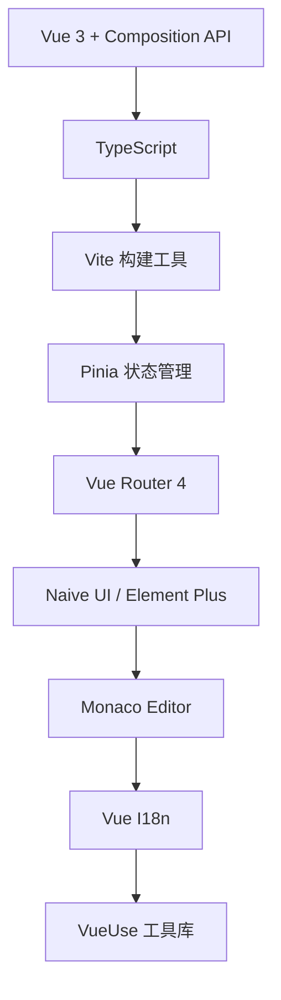

# ELP Vue 3 现代化架构方案

## 技术栈概览

### 前端技术栈（Vue 3生态）



| 技术/库 | 版本 | 用途 | 优势 |
|---------|------|------|------|
| Vue 3 | ^3.3.0 | 前端框架 | Composition API、性能优化、TypeScript支持 |
| TypeScript | ^5.0.0 | 类型系统 | 类型安全、IDE支持、代码质量 |
| Vite | ^4.4.0 | 构建工具 | 快速热重载、ESM支持、插件生态 |
| Pinia | ^2.1.0 | 状态管理 | Vue 3官方推荐、TypeScript原生支持 |
| Vue Router | ^4.2.0 | 路由管理 | SPA路由、动态路由、路由守卫 |
| Naive UI | ^2.34.0 | UI组件库 | Vue 3原生、TypeScript、主题定制 |
| Monaco Editor | ^0.44.0 | 代码编辑器 | 强大的代码编辑、语法高亮、智能提示 |
| Vue I18n | ^9.4.0 | 国际化 | 多语言支持、动态切换 |
| VueUse | ^10.4.0 | 组合式工具库 | 实用的组合式函数、响应式工具 |

## 项目结构设计

```
frontend/
├── src/
│   ├── components/          # 通用组件
│   │   ├── ui/             # 基础UI组件
│   │   ├── business/       # 业务组件
│   │   └── layout/         # 布局组件
│   ├── composables/        # 组合式函数
│   │   ├── useAuth.ts      # 认证相关
│   │   ├── useLevel.ts     # 关卡相关
│   │   └── useProgress.ts  # 进度相关
│   ├── stores/             # Pinia状态管理
│   │   ├── auth.ts         # 用户认证
│   │   ├── levels.ts       # 关卡数据
│   │   └── progress.ts     # 学习进度
│   ├── views/              # 页面组件
│   │   ├── Home.vue        # 首页
│   │   ├── Levels.vue      # 关卡列表
│   │   ├── Learning.vue    # 学习界面
│   │   └── Dashboard.vue   # 仪表板
│   ├── router/             # 路由配置
│   │   └── index.ts        
│   ├── types/              # TypeScript类型定义
│   │   ├── api.ts          # API类型
│   │   ├── level.ts        # 关卡类型
│   │   └── user.ts         # 用户类型
│   ├── utils/              # 工具函数
│   │   ├── api.ts          # API封装
│   │   ├── storage.ts      # 本地存储
│   │   └── validation.ts   # 验证函数
│   ├── styles/             # 样式文件
│   │   ├── main.css        # 全局样式
│   │   ├── variables.css   # CSS变量
│   │   └── components.css  # 组件样式
│   ├── locales/            # 国际化文件
│   │   ├── zh-CN.json      # 中文
│   │   ├── en-US.json      # 英文
│   │   └── index.ts        # 配置文件
│   ├── App.vue             # 根组件
│   └── main.ts             # 入口文件
├── public/                 # 静态资源
├── tests/                  # 测试文件
│   ├── unit/               # 单元测试
│   ├── integration/        # 集成测试
│   └── e2e/                # 端到端测试
├── vite.config.ts          # Vite配置
├── tsconfig.json           # TypeScript配置
├── tailwind.config.js      # Tailwind配置
└── package.json            # 依赖配置
```

## 核心架构实现

### 1. Vue 3 Composition API 架构

```typescript
// composables/useLevel.ts
import { ref, reactive, computed } from 'vue'
import { useLevelStore } from '@/stores/levels'
import type { Level, LevelProgress } from '@/types/level'

export function useLevel(levelId: string) {
  const levelStore = useLevelStore()
  const loading = ref(false)
  const error = ref<string | null>(null)
  
  const level = computed(() => 
    levelStore.getLevelById(levelId)
  )
  
  const progress = computed(() =>
    levelStore.getProgressByLevelId(levelId)
  )
  
  const submitCode = async (code: string) => {
    loading.value = true
    error.value = null
    
    try {
      const result = await levelStore.validateCode(levelId, code)
      return result
    } catch (err) {
      error.value = err instanceof Error ? err.message : '提交失败'
      throw err
    } finally {
      loading.value = false
    }
  }
  
  const getHint = async () => {
    return await levelStore.getHint(levelId)
  }
  
  return {
    level,
    progress,
    loading,
    error,
    submitCode,
    getHint
  }
}
```

### 2. Pinia 状态管理

```typescript
// stores/levels.ts
import { defineStore } from 'pinia'
import { ref, computed } from 'vue'
import type { Level, LevelCategory, ValidationResult } from '@/types/level'
import { api } from '@/utils/api'

export const useLevelStore = defineStore('levels', () => {
  // 状态
  const levels = ref<Level[]>([])
  const currentLevel = ref<Level | null>(null)
  const userProgress = ref<Map<string, LevelProgress>>(new Map())
  const loading = ref(false)
  
  // 计算属性
  const levelsByCategory = computed(() => {
    const categories = new Map<LevelCategory, Level[]>()
    levels.value.forEach(level => {
      const category = level.category
      if (!categories.has(category)) {
        categories.set(category, [])
      }
      categories.get(category)!.push(level)
    })
    return categories
  })
  
  const completedLevels = computed(() =>
    levels.value.filter(level => 
      userProgress.value.get(level.id)?.completed
    )
  )
  
  const overallProgress = computed(() => {
    const total = levels.value.length
    const completed = completedLevels.value.length
    return total > 0 ? (completed / total) * 100 : 0
  })
  
  // 操作
  const fetchLevels = async () => {
    loading.value = true
    try {
      const response = await api.get<Level[]>('/api/levels')
      levels.value = response.data
    } finally {
      loading.value = false
    }
  }
  
  const validateCode = async (levelId: string, code: string): Promise<ValidationResult> => {
    const response = await api.post<ValidationResult>(`/api/levels/${levelId}/validate`, {
      code
    })
    
    // 更新进度
    if (response.data.success) {
      const progress = userProgress.value.get(levelId) || {
        levelId,
        attempts: 0,
        completed: false,
        timeSpent: 0
      }
      progress.completed = true
      progress.attempts += 1
      userProgress.value.set(levelId, progress)
    }
    
    return response.data
  }
  
  const getLevelById = (id: string) => 
    levels.value.find(level => level.id === id)
  
  const getProgressByLevelId = (levelId: string) =>
    userProgress.value.get(levelId)
  
  return {
    // 状态
    levels,
    currentLevel,
    userProgress,
    loading,
    // 计算属性
    levelsByCategory,
    completedLevels,
    overallProgress,
    // 操作
    fetchLevels,
    validateCode,
    getLevelById,
    getProgressByLevelId
  }
})
```

### 3. Vue Router 4 路由配置

```typescript
// router/index.ts
import { createRouter, createWebHistory } from 'vue-router'
import { useAuthStore } from '@/stores/auth'
import type { RouteRecordRaw } from 'vue-router'

const routes: RouteRecordRaw[] = [
  {
    path: '/',
    name: 'Home',
    component: () => import('@/views/Home.vue'),
    meta: { title: 'ELP - 首页' }
  },
  {
    path: '/levels',
    name: 'Levels',
    component: () => import('@/views/Levels.vue'),
    meta: { title: '关卡列表', requiresAuth: true }
  },
  {
    path: '/level/:id',
    name: 'Learning',
    component: () => import('@/views/Learning.vue'),
    meta: { title: '学习中', requiresAuth: true },
    props: true
  },
  {
    path: '/dashboard',
    name: 'Dashboard',
    component: () => import('@/views/Dashboard.vue'),
    meta: { title: '学习仪表板', requiresAuth: true }
  },
  {
    path: '/community',
    name: 'Community',
    component: () => import('@/views/Community.vue'),
    meta: { title: '学习社区', requiresAuth: true }
  },
  {
    path: '/:pathMatch(.*)*',
    name: 'NotFound',
    component: () => import('@/views/NotFound.vue'),
    meta: { title: '页面未找到' }
  }
]

const router = createRouter({
  history: createWebHistory(),
  routes,
  scrollBehavior(to, from, savedPosition) {
    if (savedPosition) {
      return savedPosition
    }
    return { top: 0 }
  }
})

// 路由守卫
router.beforeEach(async (to, from, next) => {
  const authStore = useAuthStore()
  
  // 设置页面标题
  document.title = to.meta.title as string || 'ELP'
  
  // 检查认证
  if (to.meta.requiresAuth && !authStore.isAuthenticated) {
    next({ name: 'Home', query: { redirect: to.fullPath } })
    return
  }
  
  next()
})

export default router
```

### 4. 组件设计系统

```vue
<!-- components/ui/BaseButton.vue -->
<template>
  <button
    :class="buttonClasses"
    :disabled="loading || disabled"
    @click="handleClick"
  >
    <Icon v-if="loading" name="loading" class="animate-spin" />
    <Icon v-else-if="icon" :name="icon" />
    <span v-if="$slots.default"><slot /></span>
  </button>
</template>

<script setup lang="ts">
import { computed } from 'vue'
import Icon from './Icon.vue'

interface Props {
  variant?: 'primary' | 'secondary' | 'danger' | 'ghost'
  size?: 'sm' | 'md' | 'lg'
  loading?: boolean
  disabled?: boolean
  icon?: string
}

const props = withDefaults(defineProps<Props>(), {
  variant: 'primary',
  size: 'md',
  loading: false,
  disabled: false
})

const emit = defineEmits<{
  click: [event: MouseEvent]
}>()

const buttonClasses = computed(() => [
  'inline-flex items-center justify-center font-medium rounded-lg transition-colors',
  'focus:outline-none focus:ring-2 focus:ring-offset-2',
  'disabled:opacity-50 disabled:cursor-not-allowed',
  {
    // 尺寸样式
    'px-3 py-1.5 text-sm': props.size === 'sm',
    'px-4 py-2 text-base': props.size === 'md',
    'px-6 py-3 text-lg': props.size === 'lg',
    
    // 变体样式
    'bg-blue-600 text-white hover:bg-blue-700 focus:ring-blue-500': 
      props.variant === 'primary',
    'bg-gray-200 text-gray-900 hover:bg-gray-300 focus:ring-gray-500': 
      props.variant === 'secondary',
    'bg-red-600 text-white hover:bg-red-700 focus:ring-red-500': 
      props.variant === 'danger',
    'bg-transparent text-gray-700 hover:bg-gray-100 focus:ring-gray-500': 
      props.variant === 'ghost'
  }
])

const handleClick = (event: MouseEvent) => {
  if (!props.loading && !props.disabled) {
    emit('click', event)
  }
}
</script>
```

### 5. Monaco Editor 集成

```vue
<!-- components/business/CodeEditor.vue -->
<template>
  <div class="code-editor">
    <div class="editor-toolbar">
      <div class="flex items-center space-x-2">
        <select v-model="language" @change="updateLanguage">
          <option value="javascript">JavaScript</option>
          <option value="typescript">TypeScript</option>
          <option value="json">JSON</option>
          <option value="css">CSS</option>
        </select>
        <BaseButton
          variant="secondary"
          size="sm"
          icon="format"
          @click="formatCode"
        >
          格式化
        </BaseButton>
        <BaseButton
          variant="secondary"
          size="sm"
          icon="reset"
          @click="resetCode"
        >
          重置
        </BaseButton>
      </div>
      <div class="flex items-center space-x-2">
        <span class="text-sm text-gray-500">
          行 {{ cursorPosition.line }}, 列 {{ cursorPosition.column }}
        </span>
      </div>
    </div>
    
    <div
      ref="editorContainer"
      class="editor-container"
      :style="{ height: `${height}px` }"
    />
  </div>
</template>

<script setup lang="ts">
import { ref, onMounted, onUnmounted, watch, nextTick } from 'vue'
import * as monaco from 'monaco-editor'
import BaseButton from '@/components/ui/BaseButton.vue'

interface Props {
  modelValue: string
  language?: string
  height?: number
  readonly?: boolean
  theme?: 'vs' | 'vs-dark' | 'hc-black'
}

const props = withDefaults(defineProps<Props>(), {
  language: 'javascript',
  height: 400,
  readonly: false,
  theme: 'vs'
})

const emit = defineEmits<{
  'update:modelValue': [value: string]
  'change': [value: string]
  'cursor-change': [position: { line: number; column: number }]
}>()

const editorContainer = ref<HTMLElement>()
const language = ref(props.language)
const cursorPosition = ref({ line: 1, column: 1 })

let editor: monaco.editor.IStandaloneCodeEditor | null = null

onMounted(async () => {
  await nextTick()
  initEditor()
})

onUnmounted(() => {
  if (editor) {
    editor.dispose()
  }
})

const initEditor = () => {
  if (!editorContainer.value) return

  editor = monaco.editor.create(editorContainer.value, {
    value: props.modelValue,
    language: language.value,
    theme: props.theme,
    readOnly: props.readonly,
    automaticLayout: true,
    minimap: { enabled: false },
    fontSize: 14,
    lineNumbers: 'on',
    roundedSelection: false,
    scrollBeyondLastLine: false,
    wordWrap: 'on'
  })

  // 监听内容变化
  editor.onDidChangeModelContent(() => {
    const value = editor?.getValue() || ''
    emit('update:modelValue', value)
    emit('change', value)
  })

  // 监听光标位置变化
  editor.onDidChangeCursorPosition((e) => {
    cursorPosition.value = {
      line: e.position.lineNumber,
      column: e.position.column
    }
    emit('cursor-change', cursorPosition.value)
  })
}

const updateLanguage = () => {
  if (editor) {
    monaco.editor.setModelLanguage(editor.getModel()!, language.value)
  }
}

const formatCode = () => {
  if (editor) {
    editor.getAction('editor.action.formatDocument')?.run()
  }
}

const resetCode = () => {
  if (editor) {
    editor.setValue('')
  }
}

// 监听外部代码变化
watch(() => props.modelValue, (newValue) => {
  if (editor && editor.getValue() !== newValue) {
    editor.setValue(newValue)
  }
})
</script>

<style scoped>
.code-editor {
  @apply border border-gray-300 rounded-lg overflow-hidden;
}

.editor-toolbar {
  @apply flex justify-between items-center px-4 py-2 bg-gray-50 border-b border-gray-200;
}

.editor-container {
  @apply w-full;
}
</style>
```

## 性能优化策略

### 1. 代码分割和懒加载

```typescript
// router/index.ts - 路由级别代码分割
const routes = [
  {
    path: '/levels',
    component: () => import('@/views/Levels.vue')  // 懒加载
  }
]

// 组件级别代码分割
const CodeEditor = defineAsyncComponent(() => import('@/components/CodeEditor.vue'))

// 预加载策略
const preloadComponents = () => {
  return Promise.all([
    import('@/components/CodeEditor.vue'),
    import('@/components/LevelProgress.vue')
  ])
}
```

### 2. 响应式优化

```typescript
// 使用 shallowRef 优化大对象
const largeData = shallowRef<LargeDataType>({})

// 使用 markRaw 标记不需要响应式的对象
const monacoInstance = markRaw(monaco.editor.create(...))

// 计算属性优化
const expensiveComputed = computed(() => {
  // 使用缓存避免重复计算
  return heavyCalculation(dependencies.value)
})
```

### 3. Vite 构建优化

```typescript
// vite.config.ts
import { defineConfig } from 'vite'
import vue from '@vitejs/plugin-vue'
import { resolve } from 'path'

export default defineConfig({
  plugins: [vue()],
  
  // 路径别名
  resolve: {
    alias: {
      '@': resolve(__dirname, 'src')
    }
  },
  
  // 构建优化
  build: {
    // 代码分割
    rollupOptions: {
      output: {
        manualChunks: {
          vendor: ['vue', 'vue-router', 'pinia'],
          editor: ['monaco-editor'],
          ui: ['naive-ui']
        }
      }
    },
    
    // 压缩
    minify: 'terser',
    terserOptions: {
      compress: {
        drop_console: true,
        drop_debugger: true
      }
    }
  },
  
  // 开发服务器
  server: {
    proxy: {
      '/api': {
        target: 'http://localhost:3000',
        changeOrigin: true
      }
    }
  }
})
```

## 测试策略

### 1. 单元测试（Vitest + Vue Test Utils）

```typescript
// tests/unit/components/BaseButton.test.ts
import { describe, it, expect } from 'vitest'
import { mount } from '@vue/test-utils'
import BaseButton from '@/components/ui/BaseButton.vue'

describe('BaseButton', () => {
  it('renders with default props', () => {
    const wrapper = mount(BaseButton, {
      slots: {
        default: 'Click me'
      }
    })
    
    expect(wrapper.text()).toContain('Click me')
    expect(wrapper.classes()).toContain('bg-blue-600')
  })
  
  it('emits click event', async () => {
    const wrapper = mount(BaseButton)
    await wrapper.trigger('click')
    
    expect(wrapper.emitted('click')).toBeTruthy()
  })
  
  it('shows loading state', () => {
    const wrapper = mount(BaseButton, {
      props: { loading: true }
    })
    
    expect(wrapper.find('[name="loading"]').exists()).toBe(true)
    expect(wrapper.attributes('disabled')).toBeDefined()
  })
})
```

### 2. 组合式函数测试

```typescript
// tests/unit/composables/useLevel.test.ts
import { describe, it, expect, vi } from 'vitest'
import { useLevel } from '@/composables/useLevel'
import { createPinia, setActivePinia } from 'pinia'

describe('useLevel', () => {
  beforeEach(() => {
    setActivePinia(createPinia())
  })
  
  it('fetches level data', async () => {
    const { level, loading } = useLevel('level-01')
    
    expect(loading.value).toBe(false)
    expect(level.value).toBeDefined()
  })
  
  it('submits code successfully', async () => {
    const { submitCode } = useLevel('level-01')
    
    const result = await submitCode('console.log("hello")')
    expect(result.success).toBe(true)
  })
})
```

## 国际化配置

```typescript
// locales/index.ts
import { createI18n } from 'vue-i18n'
import zhCN from './zh-CN.json'
import enUS from './en-US.json'

const messages = {
  'zh-CN': zhCN,
  'en-US': enUS
}

export const i18n = createI18n({
  legacy: false,
  locale: 'zh-CN',
  fallbackLocale: 'en-US',
  messages
})

// 在组件中使用
import { useI18n } from 'vue-i18n'

export default {
  setup() {
    const { t, locale } = useI18n()
    
    const changeLanguage = (lang: string) => {
      locale.value = lang
    }
    
    return {
      t,
      changeLanguage
    }
  }
}
```

这个Vue 3架构方案充分利用了Vue 3的现代特性，包括Composition API、更好的TypeScript支持、以及丰富的生态系统。相比React方案，Vue 3提供了更简洁的模板语法、更直观的响应式系统、以及更好的学习曲线，非常适合ELP这样的学习平台项目。